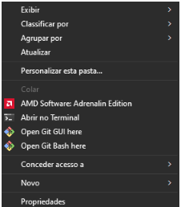
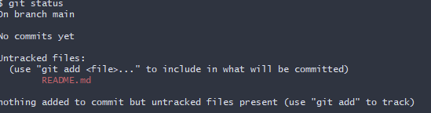
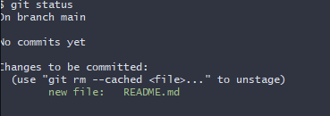
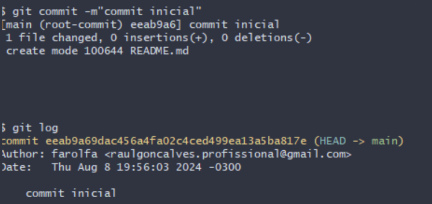
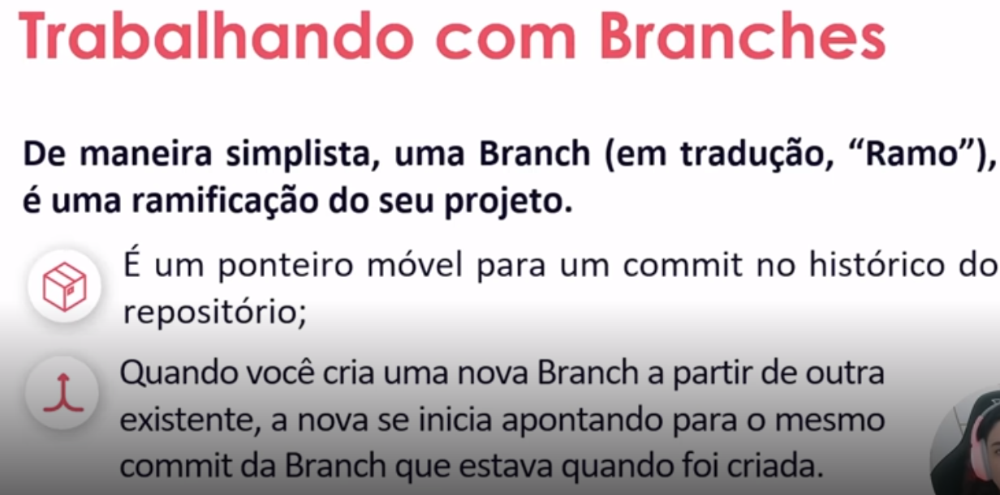
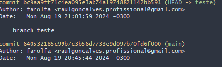
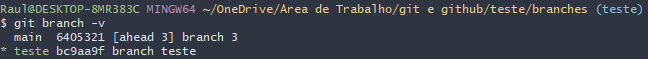

## 📚 Git e Github aprendendo sobre repositorios locais e remotos

nesse artigo estarei falando o basico sobre criar um arquivo git e como salvar localmente como deletar e exportar para o github

## inicialmente falando...

precisamos de uma base para nos guiarmos
sendo ele o [Enviando e Baixando Alterações com o Repositório Remoto](https://www.youtube.com/watch?v=bEW2VH3or1I&t=3s) e tambem o [Salvando Alterações no Repositório Local](https://www.youtube.com/watch?v=CfXZr-goMJQ) do Canal/Empresa - DIO 

tambem estarei deixando o link do MoisesTedeschi que contem uma [Lista dos principais comandos do Git](https://gist.github.com/MoisesTedeschi/96a5cba54c83fd59013f96015ce6ef7b) caso tenha duvida de algum comando sempre bom olhar ele.

## ok... tudo começa assim :
para o começo de tudo precisamos criar um Repositório 
e ele sera o lugar onde guyardaremos nossos arquivos ... ou seja para fazermos isso precisamos ir para uma pasta (qualquer uma),acessar com o botão direito sem ser em um arquivo e clicar em : 
|open git bash here |
|:- |

## Para criar um diretorio
 voce acabara abrindo um cmd do git (não do github sao coisas diferentes) e para criar seu diretorio é só escrever no terminal 
 
|mkdir (NOME-DA-PASTA)| 
|:- |

apos isso é só escrever 
|cd (NOME-DA-PASTA)|
|:- |

e por fim escreva
|git init|
|:- |

que fara a pasta criar um diretorio .git  

o cd serve apenas para ir para pasta (exemplo: se vc estava em d: e criou uma pasta chamada peido vc colocando cd peido ira para d:/peido )
e então voce tera criado seu diretorio git 

## 
apos voce ter feito isso é só criar um arquivo que tera toda parte escrita do seu projeto, no caso um readme.mk. Voce pode utilizar para escrever no seu readme um site chamado [readme.so](https://readme.so/pt/editor) que tera uma boa interface que te ajudara a redigir seu readme.
## criar um arquivo readme.md vazio 
basta voce usar o comando 
|touch README.md|
|:- |

e voce tera seu arquivo readme faça um texto, condizente com seu projeto, abra o arquivo faça um texto no **README.SO** e cole no readme.

## Salvando seu arquivo localmente

use o comando 
|git status|
|:- |

se tiver seguido tudo certo ele dara esse resultado:

## isso é um erro que iremos consertar

o erro em si é causado por não termos adicionado o arquivo no repositorio git , então o que faremos é adicionar ao repositorio
## 
use o comando

|git add README.md|
|:- |

e tchakabum seu burro agora temos o arquivo adicionado

## deixando uma mensagem para seu eu futuro (primeiro commit)

imagine ter que fazer uma cacetada de modificações no seu projeto e não registrar isso, **BUMMMMM** eu tenho a solução, crie um commit 
## 
para fazermos um commit basta escrever 
|git commit -m "commit inicial"|
|:- |

isso fara um salve dos arquivos e dara uma mensagem de log para seus futuros eus 
## 
exemplo

## alterando os arquivos salvos e dando novos commits
para dar novos commits é so copiar o arquivo anterior dando uma nova nomeação para eles para atualizar seus arquivos é só acrecentar os arquivos usando o comando

|git add (nome do arquivo) |
|:- |

ou usando para adicionar varios de uma vez o comando 

|git add . |
|:- |

 ## mas mano caguei no pau e apaguei os arquivos e agora?????

 simples meu bicho burro tu fez o commit né????? se tu leu tudo e não seguiu o que eu falei então é F meu parceroviski, mas se tu seguiu o fodão aqui então é  só fazer o seguinte:

 ## de o comando git 

 |git restore (nome do arquivo)|
|:- |

exemplo: **git restore README.md**

## trocando o nome do meu ultimo commit

parsa faz o seguinte pega no meu...

## 

sabe nem brincar mano, faz  o seguinte o copião, copia e cola essa merda

 |git commit --amend -m"sua nova commit"|
|:- |

mano mano que que é esse amend????? simples mano não sei e não enche o saco procura no google sei lá 

## resposta do google proce otario

irmão se é chato ein toma uma definição do google aqui seu pamonha ."O comando git commit --amend é uma forma conveniente de modificar o commit mais recente. Ele permite que você combine alterações preparadas com o commit anterior, em vez de criar um novo commit. Ele também pode ser usado simplesmente para editar a mensagem do commit anterior sem alterar seu instantâneo." 

## mas mano eu não queria trocar o nome, eu queria apagar e voltar pra um commit anterior

mano ... o que se quer ta mole. Certo temos 3 tipos de limpeza o **SOFT** o **MIXED** e o **HARD**
AAAAA MANO O QUE CADA UM FAZ????? calma padauan vou falar

## **SOFT**

o soft faz o seguinte meu parça ele pega um commit que vc escolhe e faz com que junte ele aos commits posteriores exemplo: commit1,commit2,commit3 escrevo o hash do 2 e apago o 3 colocando (là ele) tudo no 2 
## 
ficou confuso? fod... carma ai meu truta é o seguinte 
temos os dois commits tu pega um antigo e el sobrepoe o novo sacou tomalhe imagem(codigo exemplo do soft reset )

 |git reset --soft eeab9a69dac456a4fa02c4ced499ea13a5ba817e|
|:- |

## **MIXED**
o mixed nada mais e do que o reset (BRUH!!!) zoeira, Imagine que você está trabalhando em um projeto e já salvou algumas versões do seu trabalho(muito trampo), mas percebe que cometeu um erro na última versão salva (o último commit no Git). Agora, você quer voltar a uma versão anterior para corrigir o erro.

O comando git reset --mixed é como uma "borracha" que apaga a última versão salva (o último commit) da sua lista de versões, mas não apaga o trabalho que você fez. Ele simplesmente diz: "Vamos voltar a um ponto anterior e deixar as mudanças no rascunho para que eu possa revisá-las".

Então, se você usar , 
 |git reset --mixed eeab9a69dac456a4fa02c4ced499ea13a5ba817e|
|:- |
é como dizer ao Git:

Volte para uma versão anterior: Ele volta para a versão anterior (ou para outra que você escolher).
Mantenha minhas mudanças em rascunho: As mudanças que você fez, mas ainda não salvou oficialmente (commit), permanecem visíveis, prontas para você revisar ou corrigir.
Mas o mais importante é que nada é apagado. Seus arquivos ainda estão lá, apenas não estão mais prontos para serem salvos (commitados) até que você faça as correções necessárias.
 
 ## **HARD** 
 o hard não tem segredo ele apaga tudo que tenha nos arquivos superiores ficando apenas dele para tras

 comando:

 
 |git reset --hard eeab9a69dac456a4fa02c4ced499ea13a5ba817e|
|:- |

git remote add origin https://github.com/farolfa/Git-e-Github-aprendendo-sobre-repositorios-locais-e-remotos.git
git branch -M main
git push -u origin main

# irmão e se eu te falasse que da para fazer o porcesso do readme pelo proprio github voce acreditaria???

talvez...

seguinte my truta dá sim , porém voce me pergunta: como?

e eu lhe respondo: apenas clique no . (ponto) 

ponto?????

sim mano ponto o do teclado, ponto final, in inglish dot 

faça o seguinte:

na sua interface do github aperte o botão ponto 

.

e então voce abrira essa interface

boiah facin  facim!

[def]: image-3.png

## Trabalhando com Branches

o que seria? simples imagine que estamos criando um novo commit, porem em um caso especifico de querermos testar algo sem mudar um commit vamos criar uma ramificação da mesma 

(ignore a cabeça de nós todos na direita)

ao cria uma ramificação podemos fazer com que sua commit principal não seja alterada e podendo testar coisas novas em uma commit teste por exemplo.

ok ok vamos para os codes (codigos) 

## criando uma branch

primeiro de o comando 
|git checkout -b teste|
|-----:|

**ATENÇÃO**

Esse comando é equivalente a dois comandos separados:

Criar a branch:
|git branch teste|
|-----:|

Mudar para a branch recém-criada:
|git checkout teste|
|-----:|

Ao usar git checkout -b, você economiza tempo ao combinar esses dois passos em um único comando.

apos criar um arquivo echo e criar um novo commit ele ficará assim 

uma pro branch teste e outro main, ao tentar trocar usando o comando git checkout (nome branch) ele criara a ramificação de arquivos

dicks **(DICA)** : ao usar o comando git branch -v ele mostrará todas as ramificaçoes e onde esta cada uma delas

no caso o ultimo commit de cada uma delas

para mostrar todas as branches é só usar o comando

|git branch|
|-----:|

## como mesclar as branchs?

use o comando:

|git merge (nome da branch)|
|-----:|

## como apagar as branches?

use o comando:

|git branch -d (nome da branch que quer deletar)|
|-----:|

# acabou... 😭😭😭

tudo que é bom dura pouco 

ass: **Sun Tzu** a arte da guerra 